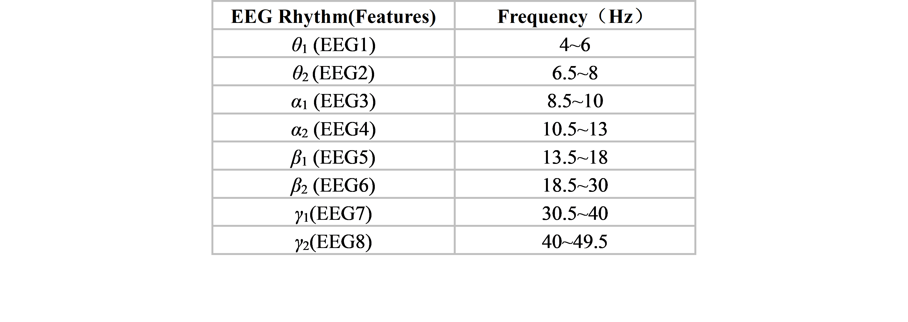

# Utilizing Cognitive Signals Generated during Human Reading to Enhance Keyphrase Extraction from Microblogs

## Overview
Data and source Code for the paper "Utilizing Cognitive Signals Generated during Human Reading to Enhance Keyphrase Extraction from Microblogs".

Nowadays, Automatic Keyphrase Extraction (AKE) with single eye-tracking source is constrained by physiological mechanism, signal processing techniques and other factors. In this paper, we propose to utilize EEG and eye-tracking signals to enhance AKE from Microblogs. Our work includes the followig aspects:

  (1) We applied different types of cognitive signals generated during human reading to AKE from Microblogs for the first time. Specifically, we combine EEG signals and Eye-tracking signals jointly to AKE based on the open-source cognitive language processing corpus ZUCO. 
  (2) We compared the effects of different frequency bands of EEG signals on the performance of the AKE. 
  (3) Furthermore, we evaluated AKE by combining the most effective EEG signals and eye-tracking signals from single-source cognitive signal tests.
  (4) Analyzing the unsatisfactory results of the previous experiments, we improved the AKE model based on Pretrained Language Models (PLMs): First, we incorporate Glove embeddings into the input layer of the SATT-BiLSTM+CRF model, which exhibited the best AKE test performance. Second, we propose an improved AKE based on BERT. Lastly, we implemented an improved AKE based on the T5 (including T5-Base and T5-Large). 

The results verified the enhancement of cognitive signals genarated during human reading on AKE. EEG signals exhibit the most significant improvement, while the combined results showed no further enhancement. T5-Large model can maximize the performance of the model without weakening the cognitive signals’ weights.

## Directory structure
```
AKE                                          Root directory
├── dataset                                  Experimental datasets
│   ├── Zuco                                 Cognitive datasets
│   │    ├── test
│   │    └── train
│   ├── Election-Trec                        AKE datasets
│   │    ├── test
│   │    └── train
│   └── General-Twitter                      AKE datasets
│        ├── test
│        └── train
├── models                                   Module of the deep learning models and pre-trained models
│   ├── pretrain_pt                          Path to store pre-trained model parameters
│   │    ├── bert.pt
│   │    └── t5.pt
│   ├── BILSTM.py                            Baseline model
│   ├── ATT-BILSTM.py                        soft attention based Bi-LSTM
│   ├── SATT-BILSTM.py                       self-attention based Bi-LSTM
│   ├── ATT-BILSTM+CRF.py                    soft attention based Bi-LSTM+CRF
│   ├── SATT-BILSTM+CRF.py                   self-attention based Bi-LSTM+CRF
│   ├── SATT-BILSTM+CRF+GloVe.py             Improved model 1
│   ├── BERT.ipynb                           Improved model 2
│   └── T5.ipynb                             Improved model 3
├── result                                   Path to store the results
│   ├── Election-Trec
│   └── General-Twitter
├── config.py                                Path configuration file
├── utils.py                                 Some auxiliary functions
├── evaluate.py                              Surce code for result evaluation
├── processing.py                            Source code of preprocessing function
└── main.py                                  Surce code for main function
```

## Dataset discription
In our study, two kinds of data are used: the cognitive signal data from human readings behaviors and the AKE from Microblogs data.
### cognitive signal data
Zuco Dataset:  In this study, we choose the Zurich Cognitive Language Processing Corpus (ZUCO), which captures eye-tracking signals and EEG signals of 12 adult native speakers reading approximately 1100 English sentences in normal and task reading modes. The raw data can be visited at: https://osf.io/2urht/#!. Only data from the normal reading mode were utilized to align with human natural reading habits. The reading corpus includes two datasets: 400 movie reviews from the Stanford Sentiment Treebank and 300 paragraphs about celebrities from the Wikipedia Relation Extraction Corpus.
We release our all train and test data in "dataset" directory, In the dataset below, cognitive features have been spliced between each word and the corresponding label. Meaning of each column of dataset:
    - Column 1: words
    - Columns 2 to 18: word-level eye-tracking signals
    - Columns 19 to 26: word-level EEG signals
    - Column 27: labels

There are 17 Eye-tracking features and 8 EEG features were extracted from the dataset:
1. Eye-tracking features: In ZUCO Corpus, Hollenstein et al.(2019) categorized the 17 eye-tracking features into three groups(Refer to Table 1): Early-Stage Features,Late-Stage Features and Contextual Features,encompassing all gaze behavior stages and contextual influences. Early-Stage Features reflect readers' initial comprehension and cognitive processing of the text, while Late-Stage Features indicate readers' syntactic and semantic comprehension. Contextual Features refer to the gaze behavior of readers on the words surrounding the current word.
<br/>
3. EEG features: EEG is a bio-electrical signal measurement used to assess brain activity by detecting electrical potential changes in brain neurons through multiple scalp electrodes. Frequency domain analysis, or spectral analysis, is a widely utilized EEG analysis method in various scientific disciplines. The recorded EEG signals used a 128-channel neural signal acquisition system, categorized into four frequency bands with two features per band (refer to Table 2. for details). 

### AKE data
1. Election-Trec Dataset: The Election-Trec dataset4 is derived from the open-source dataset TREC2011 track4. The raw data can be visited at: https://trec.nist.gov/data/tweets/. After removing all "#" symbols, it contains 24,210 training tweets and 6,054 testing tweets.
2. General-Twitter Dataset: Developed by (Zhang et al., 2016), employs Hashtags as keyphrases for each tweet. The raw data can be visited at:http://qizhang.info/paper/. It consists of 78,760 training tweets and 33,755 testing tweets, with an average sentence length of about 13 words.
    Meaning of each row of the data:
    - Empty lines indicate a sentence break, and one consecutive paragraph represents a sentence.

### Requirements
First, our system environment is set up according to the following configuration:
- Python==3.7
- Torch==1.8.0
- torchvision==0.9.0
- Sklearn==0.0
- Numpy 1.25.1+mkl
- nltk==3.6.2
- Tqdm==4.56.0

## Quick start
### Implementation steps for Bi-LSTM based experiments:
(1) Run the processing.py file to process the data into json format:
    `python processing.py` 
(2) Configure hyperparameters in the `config.py` file. There are roughly the following parameters to set:
    - `modeltype`: select which model to use for training and testing.
    - `train_path`,`test_path`,`vocab_path`,`save_path`: path of train data, test data, vocab data and results.
    - `fs_name`, `fs_num`: Name and number of cognitive traits.
    - `run_times`: Number of repetitions of training and testing.
    - `epochs`: refers to the number of times the entire training dataset is passed through the model during the training process. 
    - `lr`: learning rate.
    - `vocab_size`: the size of vocabulary. 37347 for Election-Trec Dataset, 85535 for General-Twitter.
    - `embed_dim`,`hidden_dim`: dim of embedding layer and hidden layer.
    - `batch_size`: refers to the number of examples (or samples) that are processed together in a single forward/backward pass during the training or inference process of a machine learning model.
    - `max_length`: is a parameter that specifies the maximum length (number of tokens) allowed for a sequence of text input. It is often used in natural language processing tasks, such as text generation or text classification.
(3) Modifying combinations of additive cognitive features in the model. For example, the code below means add all 25 features into the model:
    `input = torch.cat([input, inputs['et'], inputs['eeg']], dim=-1)`
(4) based on your system, open the terminal in the root directory 'AKE' and type this command:
    `python main.py` 

### Implementation steps for Large Language Models(LLMs) based experiments:
(1) BERT: Run `BERT.ipynb` in the `models/` directory:
    - Run the code in top-to-bottom order. 
    - Cognitive signals added in the model construction: `outputs = torch.concat((bert_outputs,extra_features[:,:,:]),-1)`.
    - Set epoch to 5 and train the model. Save the model parameter with the best F1 value to the path under `models/pretrain_pt`.
    - When testing, the model parameters are read from `models/pretrain_pt`.
(2) T5-Base: Run `T5.ipynb` in the `models/` directory:
    - Set parameter weight = 't5-base'.
    - Cognitive signals added in the model construction: `outputs = torch.concat((T5_outputs,extra_features[:,:,:]),-1)`. 
    - Set epoch to 5 and train the model. Save the model parameter with the best F1 value to the path under `models/pretrain_pt`.
    - When testing, the model parameters are read from `models/pretrain_pt`.
(3) T5-Large: Run `T5.ipynb` in the `models/` directory:
    - Unlike t5-Base, set parameter weight = 't5-large'.
    - Other steps are similar to the above.
